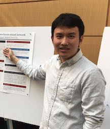

For questions and concerns, please contact [David Donoho](https://profiles.stanford.edu/david-donoho), [Vardan Papyan](https://statistics.stanford.edu/people/vardan-papyan), or [Yiqiao Zhong](https://web.stanford.edu/~yiqiaoz/). This class meets Wednesdays 3:00-4:20 PM at Bishop Auditorium [08-350](https://campus-map.stanford.edu/?srch=Bishop+Auditorium). If you are a guest speaker for this course, please read [travel section](#plan-your-visit) to plan your visit. 

* [Follow Stat385 on Twitter](https://twitter.com/stats385?lang=en)  

## Deep Learning/AI News
 * [This Is The Future Of Artificial Intelligence](http://amp.timeinc.net/fortune/2016/06/15/future-of-work-2)

##  Guest Lectures

---

<a class="talkdate" href="./StefanoSoatto_lecture">Wednesday, 10/2/19</a>  
Stefano Soatto  
UCLA

---

<a class="talkdate" href="./TengyuMa_lecture">Wednesday, 10/9/19</a>  
Tengyu Ma  
Stanford

---

<a class="talkdate" href="./JeffreyPennington_lecture">Wednesday, 10/16/19</a>  
Jeffrey Pennington  
Google, NY

---

<a class="talkdate" href="./SongMei_lecture">Wednesday, 10/23/19</a>  
Song Mei  
Stanford

---

<a class="talkdate" href="./ArthurJacot_lecture">Wednesday, 10/30/19</a>  
Arthur Jacot  
EPFL

---

<a class="talkdate" href="./AleksanderMadry_lecture">Wednesday, 11/6/19</a>  
Aleksander Madry  
MIT

---

<a class="talkdate" href="./NatiSrebro_lecture">Wednesday, 11/13/19</a>  
Nati Srebro  
TTI, Chicago

---

<a class="talkdate" href="./AndrewSaxe_lecture">Wednesday, 11/20/19</a>  
Andrew Saxe  
University of Oxford

---

<a class="talkdate" href="./papyan_lecture">Wednesday, 12/6/19</a>  
Vardan Papyan  
Stanford



## [In the media](media)

## [Reading list and other resources](readings)

## [Lecture slides](lecture_slides)  

  

## [Basic information about deep learning](basicinfo)    

## [Cheat sheet -- stuff that everyone needs to know](cheat_sheet)    



## [Blogs](blogs)

## [Grading](grading)

  

## [Plan your visit](speaker_visit)

## [Visit previous iteration of Stats385 (2017)](https://stats385.github.io/stats385_2017.github.io/)
